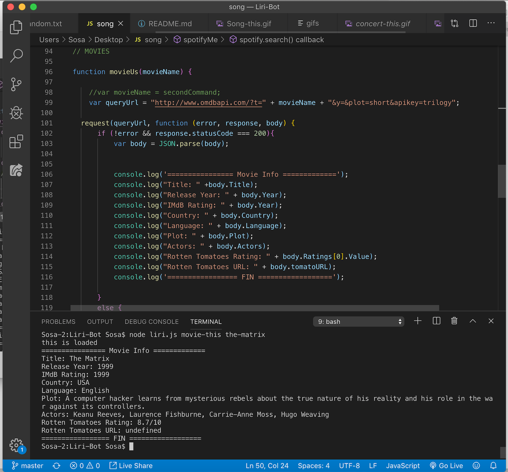
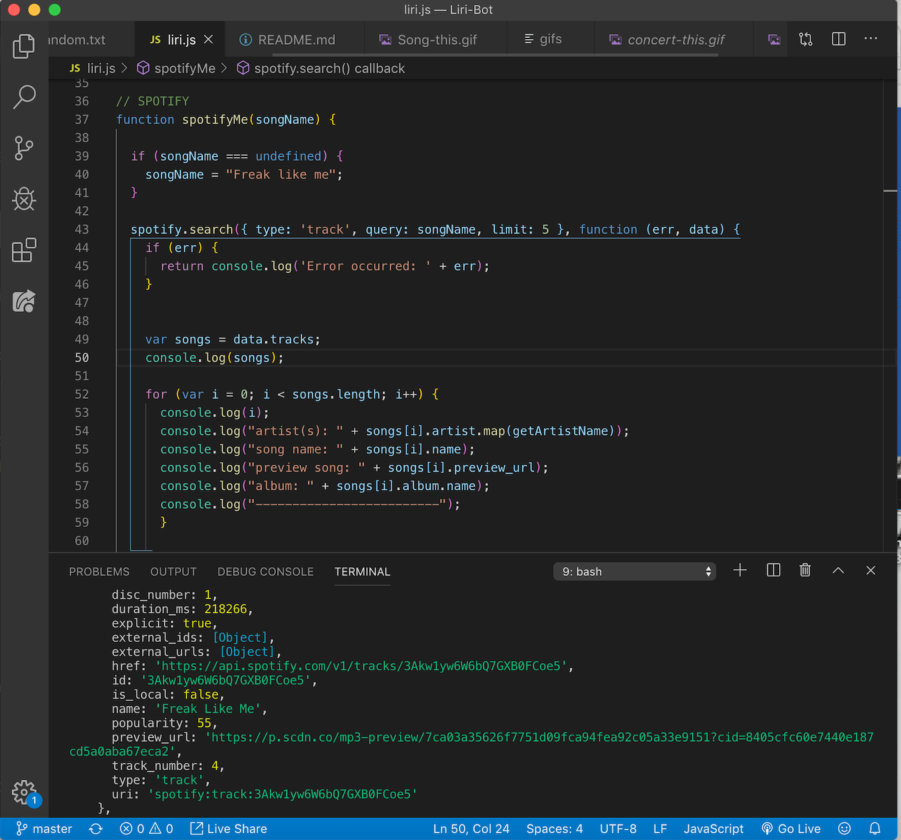
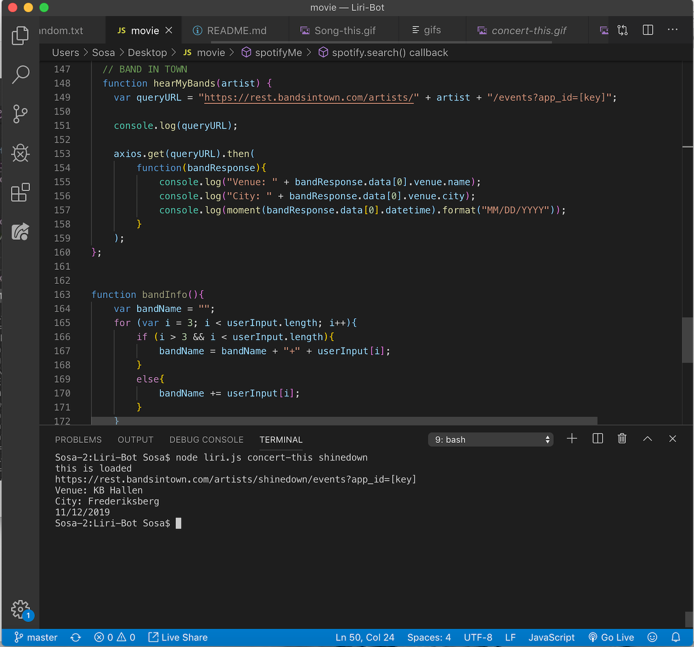

# Liri-Bot

Liri has the ability to retrieve the following information:

Searches songs on Spotify

* Artist
* Name of Song
* Popularity of Song
* Track Number

Searches movies in TMDB

* Title of Movie
* Release Year
* IMdB Rating
* Country
* Language
* Plot
* Actors
* Rotten Tomatoes Ratings

Searches band/artists

* Artist
* Venue
* City
* Date

Expected Outcomes:

* node liri.js concert-this

* node liri.js spotify-this-song

* node liri.js movie-this

* node liri.js do-what-it-says

Technologies Used:
Spotify API TMDB API BandinTown API

Movie

Concert

Spotify 

